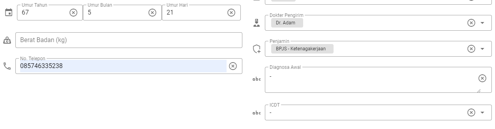
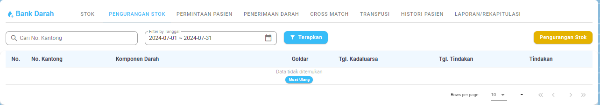

**RESUME MAGANG**

**AdamLabs**

1\. Dashboard

\- Dashboard adalah halaman utama dari AdamLabs. Pada Halaman ini paling
atas terdapat card untuk pasien yang belum diperiksa(biru),
diperiksa(abu-abu), selesai(hijau), rata-rata TAT(ungu) dan pasien
kritis(merah) yang datanya bisa difilter berdasarkan interval tanggal.

- Di bawahnya, terdapat grafik kunjungan pasien reguler & cito(kritis)
  setiap harinya. Kemudian di sampingnya ada card yang berisi kunjungan
  pasien pada hari ini dan kunjungan pasien per bulan.

- Kemudian dibawahnya ada 4 card yang berisi tentang kunjungan pasien
  dengan beberapa kategori, seperti per jenis kelamin, pemeriksaan duplo
  dan non duplo, top 5 penjamin terbanyak, dan top 5 unit asal
  terbanyak. Untuk saat ini masih laporannya masih kosong.

2\. Registrasi

\- Pada fitur registrasi, terdapat banyak form yang harus diisi kecuali
nomor antrian, berat badan, diagnosa awal, dan ICDT.

- Kemudian dibawahnya menu Pemeriksaan Patologi Klinik yang disana kita
  bisa memilih menu pemeriksaan yang akan dijalani. Pemeriksaan dibagi
  menjadi dua, yaitu grup dan individual. Pada pemilihan grup, dibagi
  menjadi sembilan yaitu Creatinine dan eGFR, Antigen, Darah Lengkap,
  Urine Lengkap, Narkoba, Darah Lengkap 3 Diff, SG OT/PT, Darah Lengkap
  5 Diff, dan Hapusan Darah Tepi. Pada pemilihan individual, ada submenu
  pemilihan yang dibagi menjadi lima yaitu, hematologi, kimia klinik,
  urine, imunoserologi, dan patologi.

- Di bawahnya lagi terdapat summary dari pemeriksaan yang telah dipilih,
  dibedakan berdasarkan pemeriksaan grup dan pemeriksaan individual.
  Kemudian ada tombol simpan untuk menyimpan registrasi.

3\. Pasien

\- Pada menu pasien, akan diperlihatkan list semua pasien, dengan nomor
laboratorium, nama pasien, tanggal periksa, nomor registrasi, status
pemeriksaan, jumlah print, dan action seperti ambil sampel atau tanggal
sampel(bagi yang sudah diambil sampelnya) dan edit data pasien.

- Jika kita memilih salah satu pasien yang telah diambil sampelnya dan
  telah check-in, maka kita akan memasuki halaman detail pemeriksaan
  pasien yang akan berisi sesuai yang kita register tadi.

- Dibawahnya kita bisa mengisi pemeriksaan berdasarkan paket pemeriksaan
  yang telah dipilih, kemudian terdapat catatan internal dan catatan
  expertise. Saat mengisi pemeriksaan, kita bisa mengatur interval nilai
  rujukan dan flagnya, kemudian ketika hasil pemeriksaan sudah kita
  simpan, maka kita bisa melakukan verifikasi kepada pasien, lalu hasil
  yang baru kita kirim akan masuk ke riwayat pemeriksaan. Setelah
  semuanya berhasil, maka status pemeriksaan berubah menjadi “Selesai”.

- Dibawah kita ada menu simpan, arsip, print, dan download.

4\. Arsip

\- Data arsip berisi pasien yang kita arsipkan saat mengisi detail
pemeriksaan diatas.

5\. POS (Point of Sales)

5.1 Laporan Rekapitulasi

\- Berisi pemasukan dari pasien dan bisa difilter menurut interval
tanggal.

5.2 Laporan Detail

\- Berisi laporan yang mendetail dari total pemasukan dari pasien,
seperti debit, lunas, belum lunas, dan cancel.

5.3 Laporan Closing

\- Berisi laporan closingan kasir.

5.3 Kasir

\- Ketika open kasir, kita akan mengisi pembayaran dari pasien-pasien.
Kemudian setelah selesai, kita akan closing kasir. Ketika semua kasir
sudah closing, kita bisa closing harian.

6\. Bank Darah

6.1 Stok

\- Terdiri dari kumpulan stok darah yang didapat dari menu penerimaan
darah. Darah terbagi menjadi beberapa golongan darah dan rhesus positif
dan negatif. Darah juga dikelompokkan lagi menjadi WB (Whole Blood) dan
PRC (Packed Red Cell). Tanda alert menunjukkan bahwa darah kadaluarsa.
Stok darah menggunakan satuan kantong.

6.2 Pengurangan Stok

- Terbagi menjadi 2, yaitu pengurangan karena pengembalian, dan
  pengurangan karena pemusnahan.

> 6.2.1 Pengembalian
>
> \- Kantong darah akan dikembalikan jika ada kondisi tertentu.
>
>  style="width:4.72983in;height:3.78178in" />
>
> 6.2.2 Pemusnahan
>
> \- Pemusnahan dilakukan karena darah kadaluarsa atau darah terindikasi
> mengandung penyakit.
>
>  style="width:4.68815in;height:3.69843in" />
>
> 6.3 Permintaan Pasien
>
> \- Berisi data pasien yang meminta donor darah
>
>  style="width:6.26806in;height:1.11181in" />
>
> 6.3.1 Form Penambahan Permintaan Pasien
>
>  style="width:6.26806in;height:3.48125in" />
>
>  style="width:6.26806in;height:3.68889in" />

- Pada permintaan darah, klik tambah permintaan terlebih dahulu. Setelah
  klik simpan, maka status dari pasien yang baru ditambahkan tersebut
  akan “Belum Diproses”

>  style="width:6.26806in;height:1.92778in" />

6.4 Penerimaan Darah

\- Pastikan untuk memencet “Tambah” sebelum menyimpan penerimaan darah.

\- Setelah ditambah, akan terlihat disini

- Akan muncul semua penerimaan darah pada tab ini.

6.5 Cross Match

\- Menampilkan semua aktivitas crossmatch(pencocokan darah) yang telah
dilakukan.

- Jika kita memilih salah satu dari pasien(ini saya memilih pasien yang
  berstatus “Belum Diproses”, maka kita harus menginput goldar dan
  rhesus pasien tersebut, dan sistem akan otomatis memberikan list
  kantong darah yang cocok untuk pasien tersebut. Setelah kita
  menyimpan, maka status pasien berubah menjadi “Proses CrossMatch”

- Disini kita akan mengisi form untuk crossmatch, dan akan menentukan
  hasilnya apakah compatible atau tidak. Setelah kita menyimpan, maka
  status pasien akan berganti menjadi “Selesai Crossmatch”. Disana kita
  bisa melakukan rujuk dan batalkan transfusi. Kita juga bisa melakukan
  transfusi dan status pasien akan berubah menjadi “Transfusi”.

6.6 Transfusi

\- Menampilkan pasien yang telah mendapatkan transfusi darah.

- Kita juga bisa menginput reaksi dari setiap pasien setelah melakukan
  transfusi darah.

6.7 Histori Pasien

\- History pasien yang telah melakukan transfusi darah.

6.8 Laporan/Rekapitulasi

\- Diatas ada card yang berisi tentang total pasien(abu), permintaan
transfusi pasien(ungu), cross match(hijau), reaksi transfusi(jingga),
transfusi darah(biru).

\- Dibawahnya ada grafik pasien yang melakukan transfusi darah yang
ditampilkan per tanggal.

\- Dibawahnya ada dua pie chart, yang kiri permintaan berdasarkan WB dan
PRC dan yang kanan adalah asal pedonor.

\- Card paling kanan ada 3 card, yang paling atas adalah total
penerimaan darah berdasarkan rutin dan daruratnya, dibawahnya ada CT
Ratio, dan dibawahnya ada TAT Bank Darah.

7\. MCU

\- List semua Medical Check Up yang ada.

- Jika kita pilih salah satu MCU yang ada, maka akan tertampil semua
  pasien yang mengikuti MCU tersebut.

7.1 Antrian

\- Antrian pasien yang memiliki nomor antrian.

7.2 Lainnya

\- Banyak yang kosong, saya have no idea selain inventory dan log.

> **AdamEds**
>
> 1\. Dashboard
>
> \- Card paling atas berfungsi untuk menampilkan seluruh kunjungan
> pasien meskipun belum booking, checkin, dan lunas. Kunjungan selesai
> menampilkan total kunjungan pasien yang selesai melakukan pemeriksaan
> di lab. Tiga terakhir merupakan total penjualan obat, pembayaran
> lunas, dan belum lunas.
>
>  style="width:6.26806in;height:2.21806in" />

- Grafik dibawah ini yang pertama adalah berdasarkan status rawat(rawat
  inap, rawat jalan, maupun IGD) yang ditampilkan perhari. Grafik
  dibawahnya merupakan grafik pemasukan dan pengeluaran yang juga
  ditampilkan perhari.

>  style="width:6.26806in;height:2.01111in" />

- Dibawah ini adalah top 5 pemeriksaan dan top 5 perujuk.

>  style="width:6.26806in;height:1.56806in" />
>
> 2\. Pendaftaran
>
> \- Pendaftaran dibagi menjadi 2, yaitu IGD dan umum. IGD otomatis akan
> memasuki Poli IGD dan status rawat menjadi IGD. Kalau umum bisa
> memilih poli dan akan bisa memilih antara rawat inap dan rawat jalan.
>
>  style="width:6.26806in;height:2.86181in" />
>
> 3\. Kasir
>
> \- Pembayaran pasien dilakukan disini, kita menginputkan nomor
> registrasi dari pasien dan kemudian mengisi detail pembayaran.
>
>  style="width:6.26806in;height:1.96181in" />
>
> 4\. Pasien
>
> \- List semua pasien, yang disini kita bisa mengedit pasien seperti
> saat registrasi. Namun ketika kita klik, akan masuk ke detail pasien.
>
>  style="width:6.26806in;height:2.63472in" />

- Detail pasien ketika dipencet akan terlihat history pasien dan detail
  informasi pasien.

>  style="width:6.26806in;height:3.38889in" />
>
> 5\. Lab
>
> \- Melakukan registrasi pasien pada form registrasi, bisa juga dengan
> mengambil pasien lama yang telah didaftarkan pada menu “Pendaftaran”
> diatas.
>
> \- Setelah diregister, maka pasien akan masuk ke pemeriksaan. Disini
> status pasien akan menjadi “Booking”. Setelah kita melakukan check-in
> kepada pasien, pasien akan mendapatkan nomor antrian dan kita bisa
> memanggil pasien tersebut dan bisa meng-assign ruangannya. Setelah
> itu, pasien bisa kita kirim ke LIS (Lab Information System) dan status
> akan berubah menjadi “Selesai”. Kita juga bisa mengedit detail
> pendaftaran pasien pada setiap status pasien.
>
> \- Pasien yang telah melunasi pembayaran maka statusnya akan menjadi
> “Lunas”. Sedangkan yang belum akan menjadi “Belum Lunas”.
>
> \- Datastok berisi stok reagen di lab.
>
> \- Datamaster Lab berisi seperti datastok namun lebih luas dan dibagi
> menjadi 3, yaitu Reagen, Satuan, dan Konsumsi.
>
> 6\. Farmasi
>
> \- Farmasi utamanya berisi tentang resep dokter yang diresepkan kepada
> pasien-pasiennya. Jika kita klik salah satu pasien, maka akan terlihat
> cara pakai dan keterangan mengenai resep obat tersebut.
>
> \- Penjualan berisi daftar penjualan obat yang telah dibayar oleh
> pasien.
>
> \- Datamaster Farmasi berisi semua data obat, satuan, kategori obat.
>
> 7\. Inventory
>
> \- Inventory berisi barang-barang yang terdapat di lab. Disini kita
> bisa menambahkan kategori barang dan kita juga bisa menambahkan barang
> keluar.
>
> 8\. Pengadaan
>
> \- Purchase Order ada tiga, yaitu PO Inventory, Farmasi, dan Lab.
> Untuk inventory, kita bisa menambahkan barang, sementara untuk farmasi
> dan lab, masing-masing bisa menambahkan obat dan reagen.
>
> 9\. Akuntansi
>
> \- Pada akuntansi, terdapat laporan seperti pembayaran kunjungan,
> pembayaran lab dan laba rugi. Total hasil pendapatan yang diterima
> dari kunjungan, lab, farmasi, dsb akan dikurangi total dari
> pengeluaran umum, lab, dan farmasi. Kemudian hasil akhir akan
> menentukan apakah untung/rugi.
